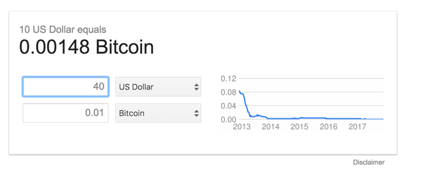
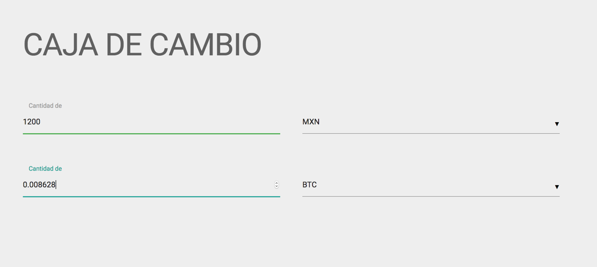

# cajadecambio
conversor monetario 

Nos inspiramos en el convertidor de monedas de Google.

El proyecto consta de un covertidor de cryptomonedas en dos direcciones. 

Se puede convertir la moneda al presionar "enter" y al cambiar de tipo de moneda. Funciona en ambas direcciones.

Notas:

https://addyosmani.com/resources/essentialjsdesignpatterns/book/

Scratch JS

